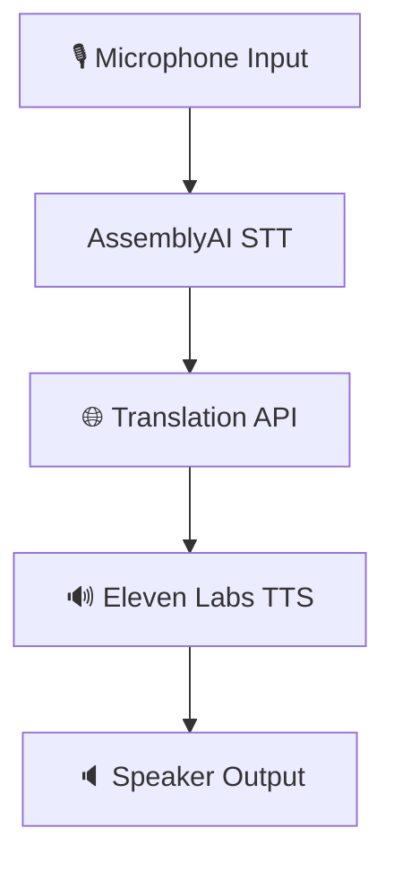

<div align="center">

# 🎙️🌍 Voice Translator Overview 🚀

<p align="center">
  
  
</p>

🎯 **Objective:**

Create a **real-time voice translator** using Python, AssemblyAI (Speech-to-Text), and Eleven Labs (Text-to-Speech) that supports dynamic translation across **10+ languages**, including:

🇮🇳 Tamil, Kannada, Hindi, Telugu, Marathi  
🌍 English, French, Spanish, German, Japanese

</div>

---

## ✨ Project Features

| Feature 🔧 | Description |
|-----------|-------------|
| 🎤 **Speech Recognition** | Convert spoken input to text using **AssemblyAI**. |
| 🌐 **Translation** | Translate recognized text to target language via **Google Translate API** or equivalent. |
| 🔊 **Text-to-Speech** | Generate speech using **Eleven Labs TTS** from translated text. |
| 🌏 **Multilingual Support** | Select **source** and **target** languages dynamically. |
| 🖥️ **User Interface (Optional)** | CLI or GUI for easy interaction. |

---

## 🧩 System Architecture



---

## ⚙️ Technologies & APIs

| Category | Tools |
|---------|-------|
| 🐍 **Python Libraries** | `speech_recognition`, `requests`, `playsound` / `pydub` |
| 🔊 **Speech-to-Text** | [AssemblyAI](https://www.assemblyai.com/) |
| 🌐 **Translation** | [Google Translate API](https://cloud.google.com/translate) or similar |
| 🗣️ **Text-to-Speech** | [Eleven Labs API](https://www.elevenlabs.io/) |

---

## 🚀 Workflow

1. 🎙️ **Capture Audio** — Record voice input via `speech_recognition` or `pyaudio`.
2. 🧠 **Speech-to-Text** — Send audio to **AssemblyAI** and receive transcription.
3. 🌐 **Translate Text** — Use **Google Translate API** to convert text into target language.
4. 🔊 **Generate Speech** — Send translated text to **Eleven Labs** to synthesize audio.
5. 🎧 **Playback Output** — Play audio using `playsound`, `pydub`, or save as `.mp3`/`.wav`.

---

## 🎨 UI (Optional but Recommended)

- **CLI Menu** using Python's `argparse` or `typer`
- **GUI with Tkinter / PyQt5** for language selection, input/output display, and buttons

---

## 💡 Future Enhancements

- 🧠 Add language detection
- 🗃️ Offline mode using local STT/TTS engines
- 🌐 Web-based version (Flask + React)
- 📲 Mobile app integration

---

## 📜 License

This project is licensed under the **MIT License**.

<div align="center">
  
</div>
```
